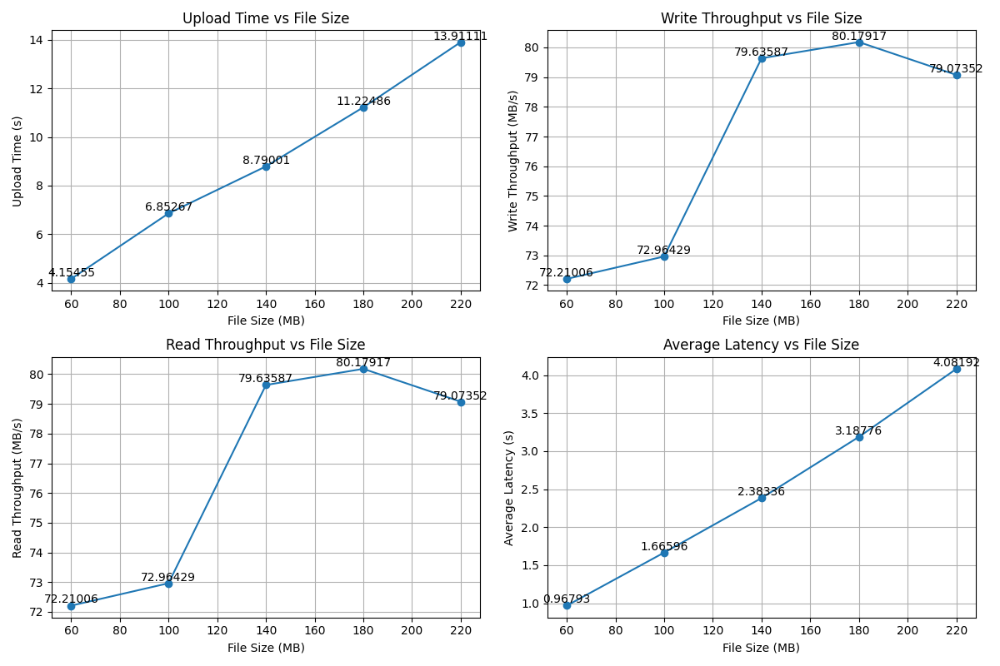
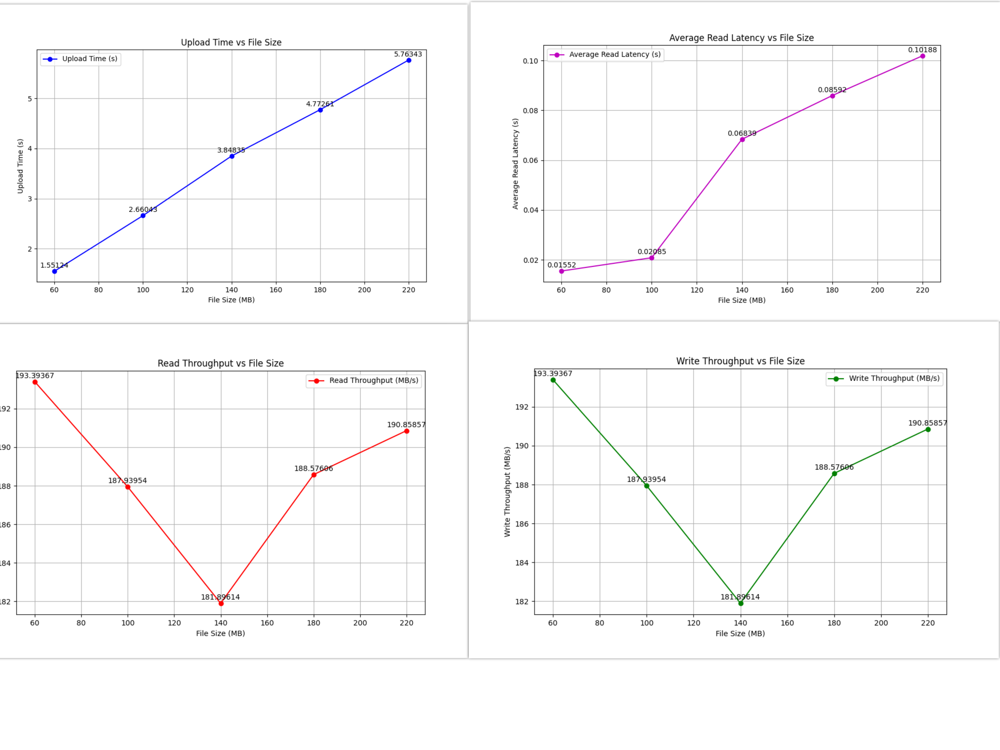

# S3 vs RocksDB Benchmark

This repository benchmarks the performance of Amazon S3 (using OpenStack) and RocksDB (using the `rocksdict` Python library). The tests compare **read throughput**, **write throughput**, **upload time**, and **average read latency** for file sizes of 60MB, 100MB, 140MB, 180MB, and 220MB.


## Results Overview

*Note: The upload represents upload time for 5 files, each of specified sizes.*

### Amazon S3 Results


### RocksDB Results


## How to Run

1. Install the required dependencies:
   ```bash
   pip install -r requirements.txt
